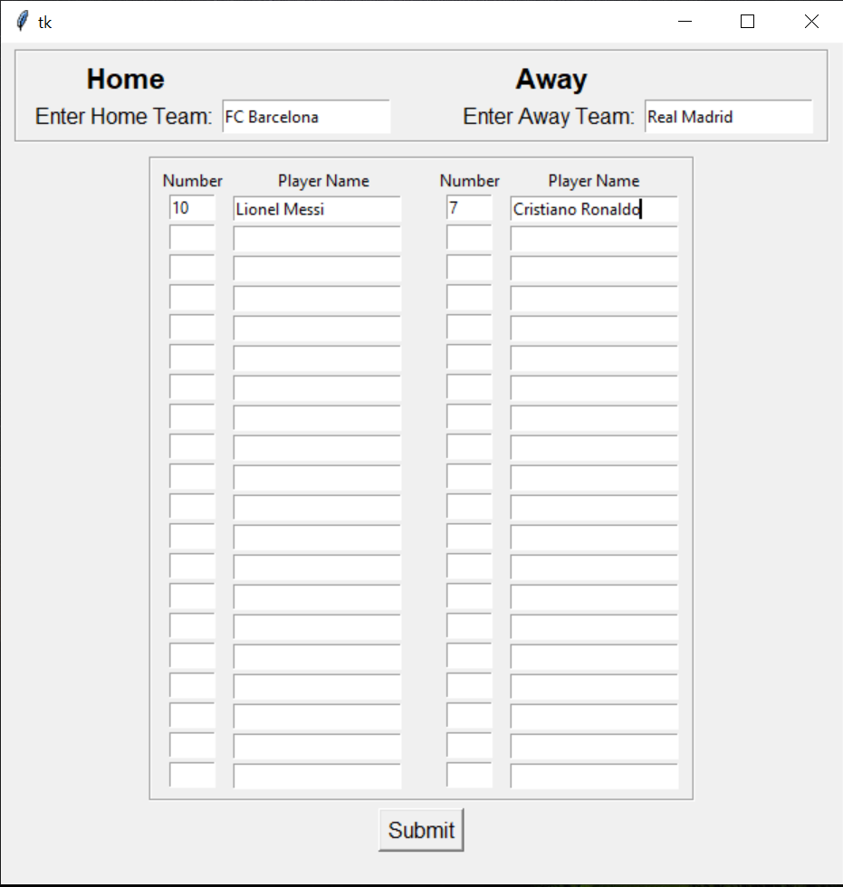
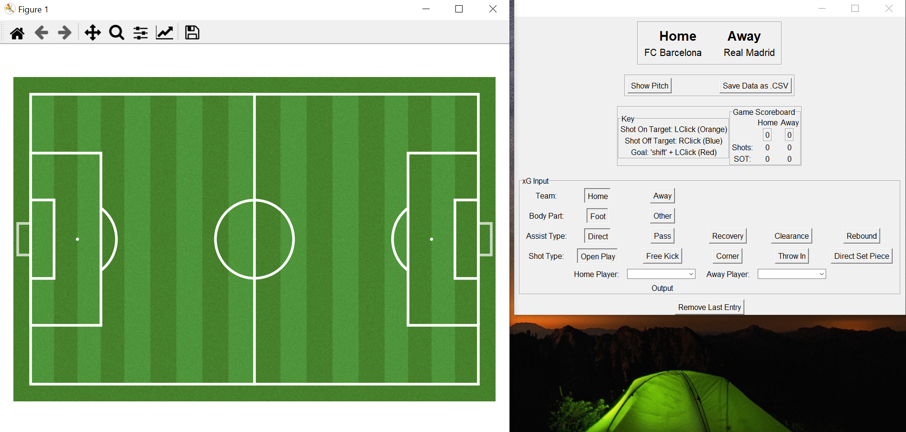

# Expected-Goals-GUI
Graphic User Interface to output and collect expected goals data

## Expected Goals Model
The expected goals model used in this repository was created by Andrew Rowlinson. Slightly different data but same exact process.
You can take a look at how the model was generated here: https://github.com/andrewRowlinson/expected-goals-thesis

## Installation
#### Requirements
* Python 3.7.9 was utilized, but should work with other versions.
* Windows

#### Conda Installation
Install conda: https://repo.anaconda.com/miniconda/
```shell
conda create -n expected-goals python=3.7.9 -y
conda activate expected-goals

git clone https://github.com/yumamoto164/Expected-Goals-GUI.git
cd Expected-Goals-GUI

pip install -r requirements.txt
```

#### Pip Installation
```shell
git clone https://github.com/yumamoto164/Expected-Goals-GUI.git
cd Expected-Goals-GUI

pip install -r requirements.txt
```

## Running the Program
Run the following code in your terminal:
```shell
python Soccer.py
```

You should see the following window in which you can input the home/away teams and the lineups for each respective team:



After filling out the team lineups and clicking submit, you have to click on "show pitch" to display the 2D representation of the football/soccer pitch 
where you want to record the expected goals data. The 2 windows should look like this side by side:



The window pictured to the right is where you input the independent variables that determine the expected goals output (using the buttons).
The left window is where you click on where the shot was taken.
* Shot On Target: Left Click
* Shot Off Target: Right Click
* Goal: Shift + Left Click

The football/soccer pitch library (mplsoccer) was created by Andrew Rowlinson as well, and can be accessed here:
https://github.com/andrewRowlinson/mplsoccer

Once your done recording the data, you can click "Save Data as CSV" and save all of the data as a csv/excel file.
